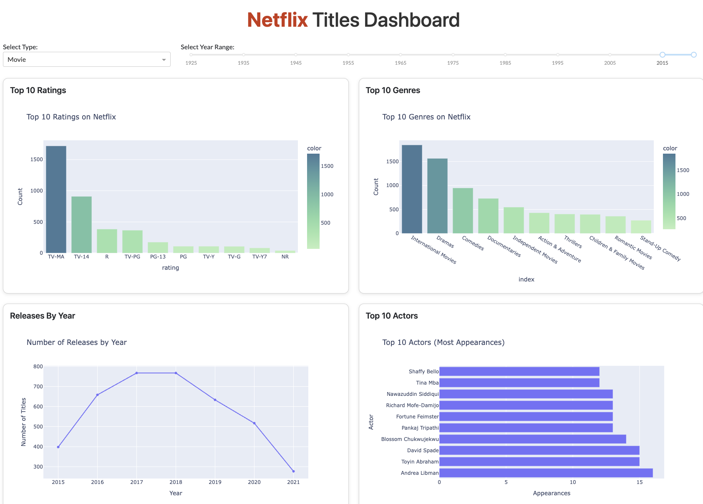

# Netflix Reporting Dashboard

A modern, interactive reporting dashboard built with **Python**, **Dash**, **Plotly**, and **Dash Bootstrap Components**—showcasing Netflix titles data. This project provides insights on the top ratings, genres, release trends, actors, and more.



*(Above: A sample view of the dashboard showing interactive filters for Type and Year range.)*

---

## Key Features

1. **Interactive Filters**  
   - **Type Dropdown**: Filter between Movies, TV Shows, or All.  
   - **Year Range Slider**: Dynamically narrow down releases by a specific time period.

2. **Rich Visualizations**  
   - **Top 10 Ratings** bar chart.  
   - **Top 10 Genres** bar chart.  
   - **Releases by Year** line chart.  
   - **Top 10 Actors** by appearances, based on the `cast` column.  
   - **Longest Movies** (horizontal bar chart of top 10 longest durations).  
   - **Word Bubble** from `description` text, approximating a simple word cloud.

3. **Responsive Layout**  
   - Uses [Dash Bootstrap Components](https://dash-bootstrap-components.opensource.faculty.ai/) for a clean, modern design.  
   - Mobile-friendly with fluid container sizing.

4. **Real-Time Updates**  
   - When users change the filters (Type or Year Range), all charts update immediately via Dash **callbacks**.

5. **Sleek Branding**  
   - The “Netflix” title in the header is styled with Netflix’s signature **red** (#E50914) for brand consistency.

---

## How It Works

1. **Data**: A CSV file (`netflix_titles.csv`) is read into a Pandas DataFrame.  
2. **Filtering**: The app uses a function to filter data by `type` (Movie / TV Show) and a specified year range.  
3. **Callbacks**: Dash callbacks update multiple figures whenever a filter value changes.  
4. **Charts**: Each Plotly Express figure is built dynamically:
   - **Ratings** & **Genres**: Count-based bar charts of the top categories.  
   - **Yearly Additions**: Groups titles by `release_year` and charts them over time.  
   - **Top Actors**: Splits the cast strings and counts appearances.  
   - **Longest Movies**: Shows the top 10 longest films by minutes.  
   - **Word Bubble**: Simple textual analysis of `description`.

---

## Installation & Setup

1. **Clone this repository**:
   ```bash
   git clone https://github.com/YourUsername/Netflix-Dash.git
   cd Netflix-Dash
